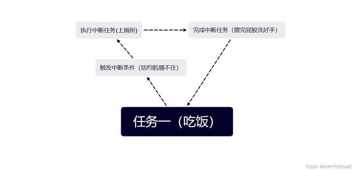
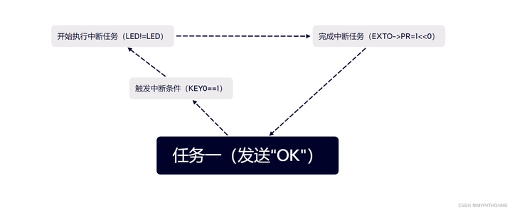

# 前言

> 在阅读本文前请先了解如何实现按键电灯。
---
# 一、中断原理

> 单片机只能串行运行程序，无法一边烧开水一边洗衣服。  

所以如果单片机吃饭(任务一)吃到一半想上厕所（中断任务）怎么办？  
- 首先得你的括约肌得先绷不住（触发中断条件），  
- 然后你放下碗筷去往厕所（执行中断任务），  
- 擦好屁股洗好手（完成中断任务），  
- 回来继续吃饭(任务一)。

# 二、实例——外部中断按键点灯

## led.h

    #ifndef __LED_H
    #define __LED_H  
    #include "sys.h"

    //LED端口定义
    #define LED0 PAout(8)   // PA8

    void LED_Init(void);    //初始化                           
    #endif
## led.c
    #include "sys.h"   
    #include "led.h"

    //初始化PA8
    //LED IO初始化
    void LED_Init(void)
    {
        RCC->APB2ENR|=1<<2;    //使能PORTA时钟               
        GPIOA->CRH&=0XFFFFFFF0; 
        GPIOA->CRH|=0X00000003;//PA8 推挽输出        
        GPIOA->ODR|=1<<8;      //PA8 输出高
    }
## key.h
    #ifndef __KEY_H
    #define __KEY_H  
    #include "sys.h"

    #define KEY0  PCin(5)       //PC5
    
    void KEY_Init(void);        //IO初始化
    #endif

    key.c
    #include "key.h"
    #include "delay.h"
    
    //按键初始化函数 
    //PA0.15和PC5 设置成输入
    void KEY_Init(void)
    {
        GPIOC->CRL&=0XFF0FFFFF; //PC5设置成输入    
        GPIOC->CRL|=0X00800000;   
        GPIOC->ODR|=1<<5;       //PC5上拉
    }
以上程序实现，`KEY0=PCin(5)`，为上拉输入，即按键未按时，`PC5`读入高电平，`KEY0=1`；当接地时（按键按下时），`PC5`电平下降（！！中断触发条件），`KEY(0)=0`。
## main.c
    #include "sys.h"
    #include "usart.h"      
    #include "delay.h"  
    #include "led.h"  
    #include "exti.h" 
    //可以看到我们并未在main函数中引入"key.h"

    int main(void)
    {           
        Stm32_Clock_Init(9);//系统时钟设置
        delay_init(72);     //延时初始化
        uart_init(72,9600); //串口初始化 
        LED_Init();         //初始化与LED连接的硬件接口
        EXTI_Init();        //外部中断初始化
        LED0=0;             //点亮LED
        while(1) //程序在主函数中陷入死循环
        {       
            printf("OK\r\n");
            delay_ms(1000);   
        } 
    }
我让`main`函数陷入串口发送“OK”的死循环，按照串行逻辑，此时按键无法对程序执行产生影响。但当我们引入中断，就可以实现如图功能：

接下来我们进入中断函数：

## exit.c
    #include "exti.h"
    #include "led.h"
    #include "key.h"
    #include "delay.h"
    #include "usart.h"

    //外部中断9~5服务程序
    void EXTI9_5_IRQHandler(void)
    {           
        delay_ms(10);   //消抖             
        if(KEY0==0)     //按键0
        {
            LED0=!LED0;
        }
        EXTI->PR=1<<5;     //清除LINE5上的中断标志位  
    }

    //外部中断初始化程序
    //初始化PC5为中断输入.
    void EXTI_Init(void)
    {
        KEY_Init();
        Ex_NVIC_Config(GPIO_C,5,FTIR);      //下降沿触发
        MY_NVIC_Init(2,0,EXTI9_5_IRQn,2);   //抢占2，子优先级1，组2  
    }
### 中断初始化EXTI_Init(void)
在main.c开始，我们先进行了`EXTI_Init(void)`，所以需要了解三个中断设置函数：

**设置函数MY_NVIC_Init**

该函数有 4 个参数，分别为： `NVIC_PreemptionPriority` 、` NVIC_SubPriority `、 `NVIC_Channel`、 `NVIC_Group `。
第一 个 参数` NVIC_PreemptionPriority `为中断抢占优先级数值，第二个参数 `NVIC_SubPriority `为中断子优先 级数值，前两个参数的值必须在规定范围内，否则也可能产生意想不到的错误。第三个参数 `NVIC_Channel `为中断的编号，最后一个参数 `NVIC_Group `为中断分组设置（范围为 0~4）。

**分组函数 MY_NVIC_PriorityGroupConfig**

该函数的参数` NVIC_Group `为要设置的分组号，可选范围为0至4，总共 5 组。如果参数非法，将可能导致不可预料的结果。
规定触发方式`Ex_NVIC_Config`
该函数有3个参数：`GPIOx` 为 `GPIOA~G（0~6）`，在 `sys.h `里面有定义。代表要配置的 IO 口。`BITx `则代表这个 IO 口的第几位。`TRIM `为触发方式，低 2 位有效（`0x01 `代表下降触发；`0x02 `代表 上升沿触发；`0x03` 代表任意电平触发）。

    //外部中断初始化程序
    //初始化PC5为中断输入
    void EXTI_Init(void)
    {
        KEY_Init();//对按键的输入输出进行初始化，KEY=PCin（5）

        //规定中断触发条件，本程序中是PC5in电平下降
        Ex_NVIC_Config(GPIO_C,5,FTIR);      //下降沿触发
        //如果是高电平触发，则FTIR改为RTIR

        MY_NVIC_Init(2,0,EXTI9_5_IRQn,2);   //抢占2，子优先级0，组2  
    }

**中断服务函数EXTI9_5_IRQHandler(void)**

该程序即为“上厕所”。STM32 的外部中断 0至4 都有单独的中断服务函数，但是从 5 开始， 他们就没有单独的服务函数了，而是多个中断共用一个服务函数，比如外部中断 5至9 的中断服 务函数为：`void EXTI9_5_IRQHandler(void)`，类似的，`void EXTI15_10_IRQHandler(void)`就是 外部中断 10~15 的中断服务函数。

    //外部中断9~5服务程序
    void EXTI9_5_IRQHandler(void)
    {           
        delay_ms(10);   //消抖             
        if(KEY0==0)     //按键0
        {
            LED0=!LED0;
        }
        EXTI->PR=1<<5;     //清除LINE5上的中断标志位  
    }

# 总结
单片机学习到尽头就是操作系统。单片机某一时刻只能执行一件任务A。当A一个任务就能把算力全部吃掉时，这样做无可厚非；而发展到后来，硬件资源足够充足，A不足以消耗所有资源时，B\C\D程序必须等待A程序执行完毕才能执行，这无疑是一种浪费。而操作系统的优势在于能够并行程序，同时执行ABCD，充分利用硬件资源，大大提高了程序的运行速度。